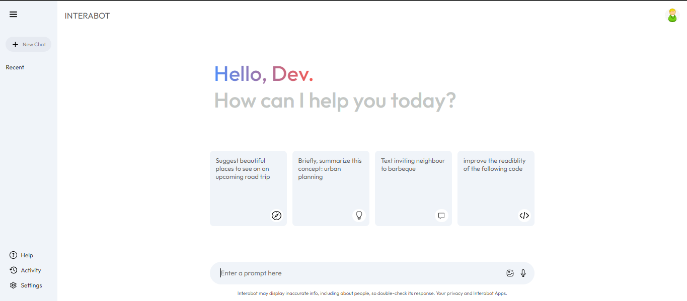
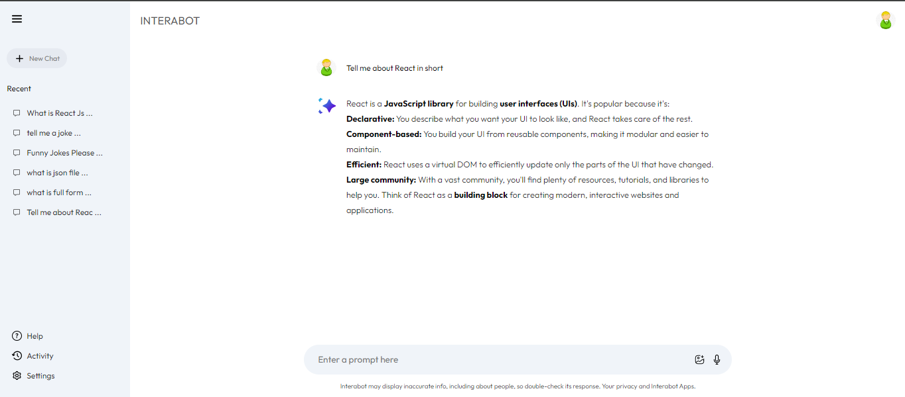

# Interabot: GeminiAI Clone

## GeminiAI Clone
<div style="text-align: justify;">
  This repository contains the code for a clone of Gemini AI, a large language model (LLM) capable of generating various creative text formats, such as poems, code, scripts, musical pieces, emails, letters, etc. It can also translate languages and provide informative answers to questions. Essentially, this AI model can be instructed to perform a wide range of tasks.
</div>

## Features

 * Generate creative text formats like poems, code, scripts, emails, and letters.
 * Translate languages.
 * Provide informative answers to questions.
   
## Link: <a href="https://intera-bot.vercel.app/" target="_blank">Interabot</a>

### Home Page to Interabot-


### Result to Input-


## Installation

### Clone the Repository to your local machine 
```
git clone https://github.com/Amisha-028/InteraBot.git
```

### Install Dependencies

```
npm install
```

### Setup .env file

```dotenv
VITE_GEMINI_API_KEY=...
```

### Start the Application

```
npm start
```

## How to USE?

 * Open the application.
 * Instruct the AI model to perform tasks like generating text, translating languages, or answering questions.
   
### Thank You for visiting.
### Stars are Appreciated.
